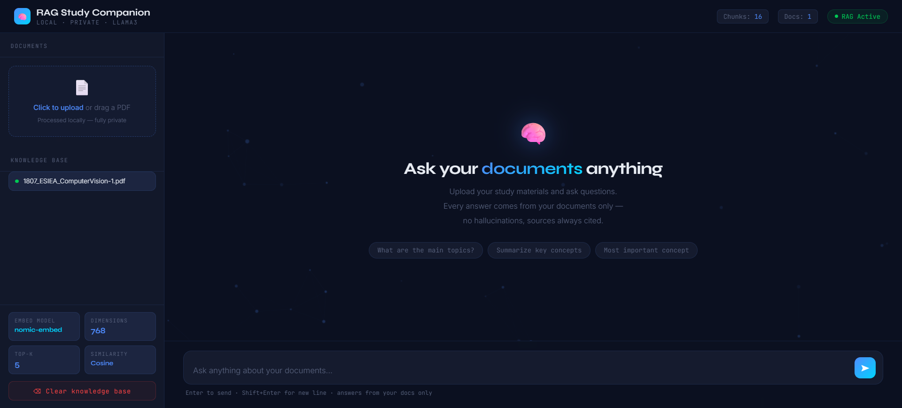
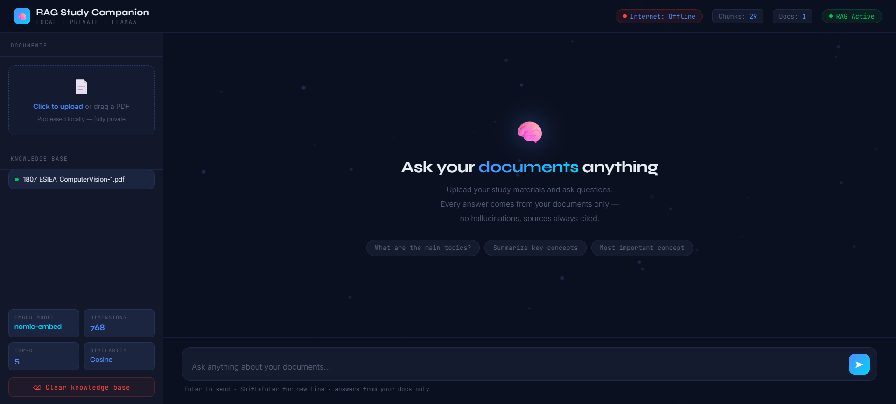
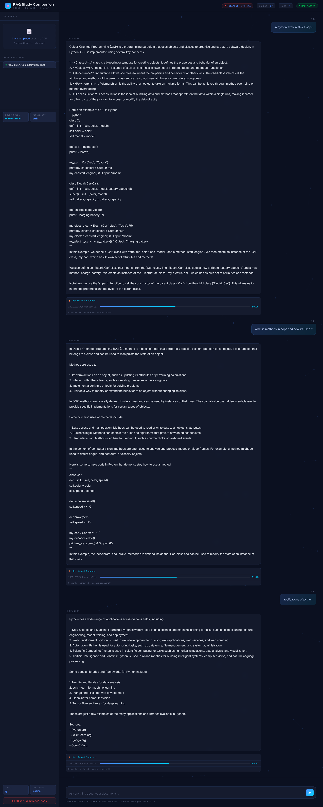
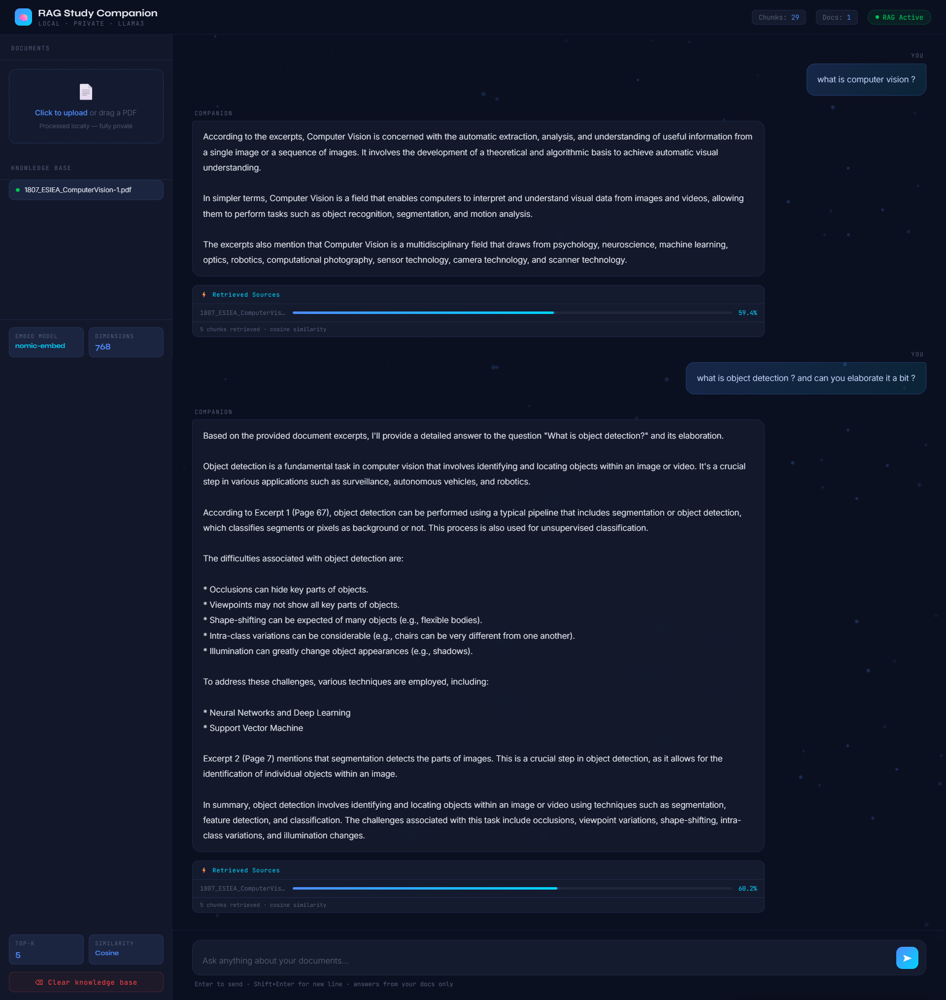

# RAG Study Companion


> A fully offline, private RAG pipeline - upload your study documents and ask questions in plain English. Every answer is grounded in your documents, with retrieved sources and relevance scores shown inline.

Started in November 2025 as a straightforward document Q&A tool. Rebuilt in June 2026 with better chunking, a hybrid answering mode, an internet status indicator, and a completely redesigned dashboard UI.

---

## Screenshots

### v2.0 - June 2026

| Dashboard | Offline Mode |
|---|---|
|  |  |
| *Clean two-panel layout - document panel left, live chat right* | *Internet status chip turns red automatically when disconnected* |

| Offline Mode Response | Out-of-Scope Question |
|---|---|
|  |  |
| *Full answers generated locally - no cloud, no API calls* | *General questions answered from model knowledge, not just the PDF* |

| Document Q&A | Follow-up Query |
|---|---|
|  |  |
| *Detailed answers with retrieved source chunks and cosine similarity scores* | *Follow-up questions stay grounded in the same document context* |

### v1.0 - November 2025

| Initial Dashboard |
|---|
|  |
| *First version - minimal UI, basic RAG pipeline, document-only answering mode* |

---

## Features

- Local-first RAG architecture
- Ollama-powered LLM responses
- ChromaDB vector search
- PDF document ingestion
- Source citations
- Relevance scoring
- Multi-document support
- Session statistics
- Knowledge Base viewer

---

## What It Does

- Upload any PDF - lecture notes, textbooks, research papers, reports
- Ask questions in plain English and get answers grounded in your documents
- Retrieved source chunks shown with cosine similarity scores for every answer
- Hybrid mode - answers from documents when relevant, general knowledge when not
- Fully offline - Llama 3.2 runs locally via Ollama, nothing leaves your machine
- Internet connectivity indicator in the topbar - goes live/offline in real time
- ChromaDB vector store persists between sessions - no re-uploading needed
- Knowledge base management - add multiple documents, clear when done

---

## How It Works

**Ingestion**
When you upload a PDF, PyMuPDF extracts the raw text page by page. The text is split into 800-character chunks with 80-character overlap to avoid losing context at boundaries. Each chunk is embedded using `nomic-embed-text` running locally via Ollama and stored in a ChromaDB persistent vector store.

**Retrieval**
On each query, the question is embedded with the same model. ChromaDB performs a cosine similarity search and returns the top 5 most relevant chunks. Relevance scores are surfaced directly in the UI so you can see exactly what the model is reading.

**Generation**
The retrieved chunks are assembled into a prompt and sent to `llama3.2:3b` via Ollama. The prompt is written to handle two cases - if the question maps to the document content, it answers from the chunks; if it's a general question (greetings, maths, coding, etc.), the model answers from its own knowledge rather than refusing. Temperature is kept low (0.3) to keep answers factual and consistent.

---

## The Two Versions

This repo has gone through two distinct phases, which is why the commit history spans from late 2025 to mid-2026.

**v1.0 - November 2025**
The first version was built to solve a personal problem - I had a stack of research PDFs and wanted a way to query them without copy-pasting into ChatGPT. The pipeline was functional but basic: fixed chunk sizes, a strict document-only prompt that would refuse any out-of-scope question, no persistence between sessions, and a minimal UI with just the essentials. It worked, but the UX had rough edges.

**v2.0 - June 2026**
After using v1 extensively for several months and identifying several limitations in both retrieval quality and user experience, the project underwent a major upgrade. The underlying model was migrated from Llama 3 to the more lightweight Llama 3.2:3B for faster local inference and improved resource efficiency. The prompt architecture was completely redesigned to support hybrid answering, allowing the assistant to respond intelligently to both document-based questions and general knowledge queries. Previously, if a user uploaded a document on one topic and asked an unrelated question, the system could return responses indicating the information was not found in the uploaded documents. The updated prompt engineering eliminates this limitation by combining retrieval-augmented generation with general-purpose reasoning. The codebase was also reorganized through the introduction of dedicated config.py and prompts.py modules, improving maintainability and simplifying future experimentation with models and prompt strategies. The UI was redesigned with a knowledge graph background animation, ingestion progress steps, a retrieval visualization panel showing source bars and similarity scores, and an internet status indicator. ChromaDB was switched to persistent mode so the vector store survives restarts and indexed documents remain available across sessions.

---

## Stack

| Layer | Tools |
|---|---|
| LLM | Llama 3.2 3B via Ollama |
| Embeddings | nomic-embed-text via Ollama |
| Vector Store | ChromaDB (persistent) |
| PDF Parsing | PyMuPDF (fitz) |
| Backend | Flask |
| Frontend | Vanilla JS, Chart.js |

---

## Running It

```bash
# 1. Clone
git clone https://github.com/your-username/rag-study-companion.git
cd rag-study-companion

# 2. Install Python dependencies
pip install -r requirements.txt

# 3. Pull Ollama models (one-time, needs internet)
ollama pull llama3.2:3b
ollama pull nomic-embed-text

# 4. Start Ollama
ollama serve

# 5. Run the app
python backend/app.py
```

Open `http://localhost:5001`

After the one-time model download, the app runs completely offline.

---

## Project Structure

```
rag-study-companion/
├── backend/
│   ├── app.py              # Flask server and API routes
│   ├── rag.py              # RAG pipeline - ingest, embed, retrieve, generate
│   └── requirements.txt
├── frontend/
│   └── index.html          # Dashboard UI
├── vectorstore/            # ChromaDB persistent store (auto-created)
├── data/
│   └── uploads/            # Uploaded PDFs (auto-created)
├── screenshots/
├── README.md
└── ROADMAP.md
```

---

## Limitations

`llama3.2:3b` is a small model - it handles most study material well but can struggle with highly technical or domain-specific content where precise terminology matters. Accuracy improves noticeably if you switch to `llama3:8b` on machines with more VRAM. The sliding window chunking works well for text-heavy PDFs but tables, equations and image-heavy documents lose some information during extraction since PyMuPDF reads text only. Multi-document cross-referencing (asking a question that spans two PDFs simultaneously) is not explicitly optimised - it works because all chunks share the same collection, but ranking across documents is not weighted.

---

*v1.0 built: November 2025 - v2.0 rebuilt and open-sourced: June 2026*
